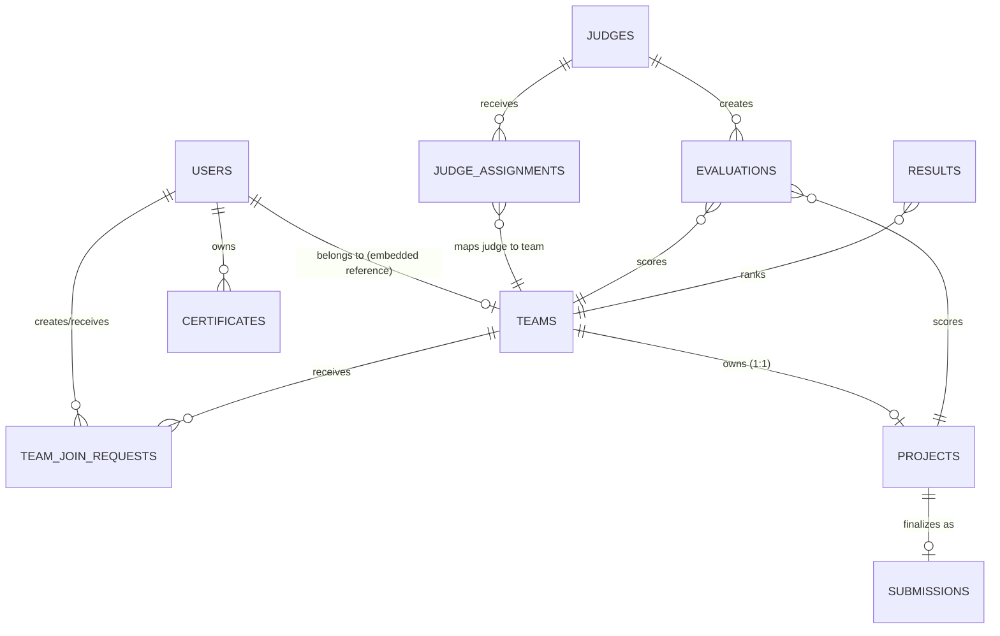

# Database Relationships Diagram

This diagram visualizes the flow and hierarchy of the Firestore schema, mapping entities to their associated roles and operations.

## Denormalization Strategy
1. **Team Members inside `teams`**: Instead of a separate `teamMembers` collection, member data (uid, name, role) is stored as an array within the `teams` document. This allows O(1) loading of a complete team profile.
2. **`teamId` inside `users`**: A direct reference is stored in the user profile to prevent querying the `teams` collection just to check if a user is currently engaged in one.
3. **Judge Assignments**: Stored separately to strictly control authorization rules, avoiding exposing all judge data within the team document.
